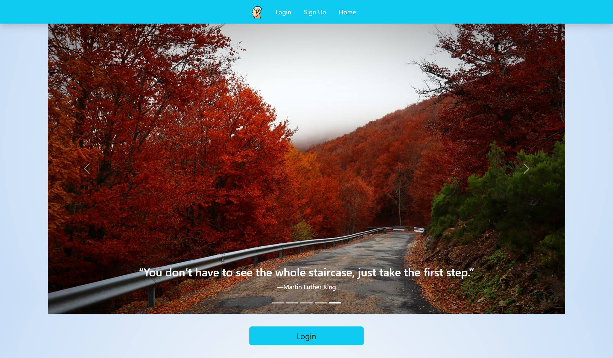
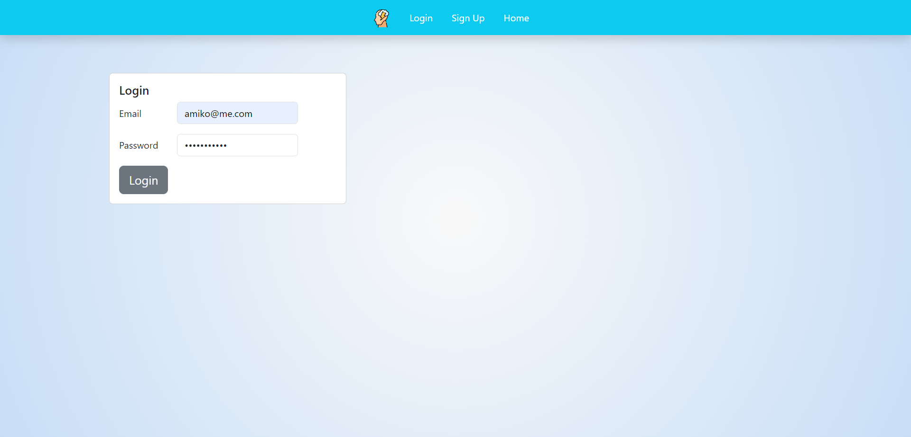
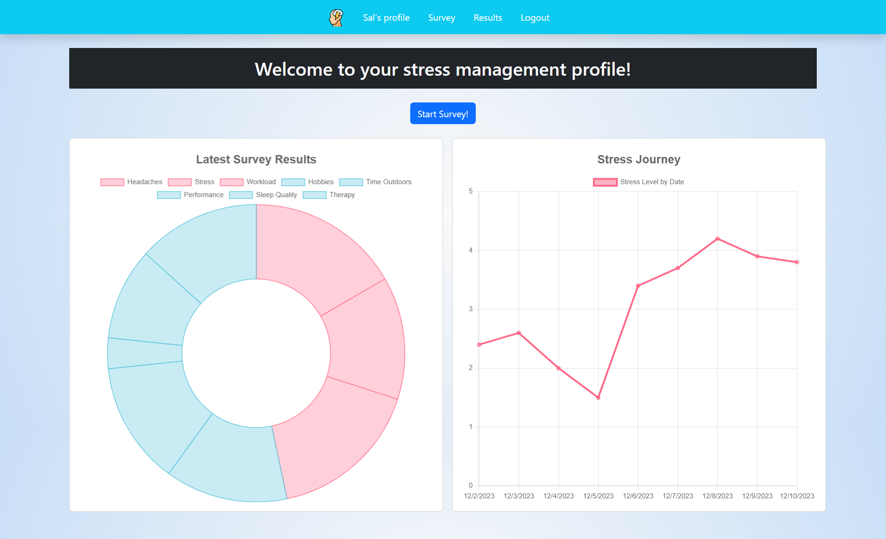
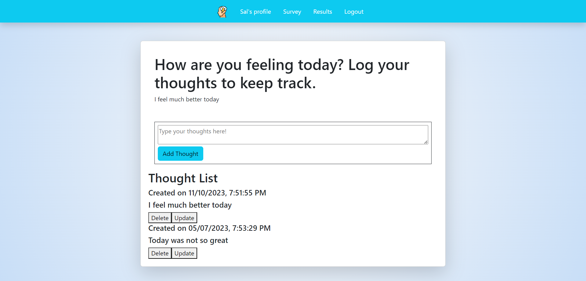
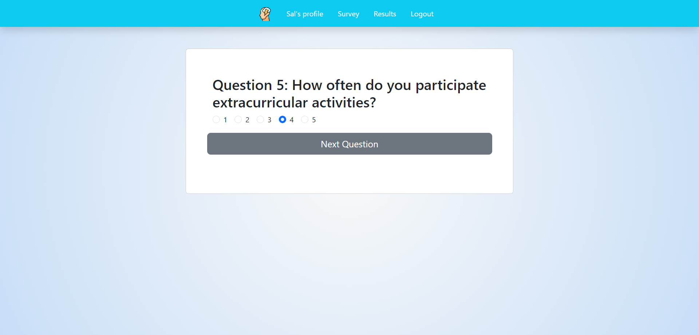

# STRESS FREE ME (v2.0)
UTA Coding Bootcamp Final Project 3

## Description
Embark on a transformative stress management journey with our cutting-edge Daily Stress Tracking App. Begin with our complimentary stress analysis quiz, meticulously designed to assess a myriad of factors impacting your stress levels. Delve into comprehensive results that illuminate key stress triggers, enabling you to make informed decisions for stress reduction and lifestyle enhancement. Elevate your well-being as you navigate this user-friendly interface, guiding you towards a harmonious and stress-free existence. 

## Table of Contents
- [User Story](#user-story)
- [Acceptance Criteria](#acceptance-criteria)
- [Technologies Used](#technologies-used)
- [References](#references)
- [Resources](#resources)
- [Development Goals](#development-goals)
- [Links](#links)
- [Site Preview](#preview)
- [License](#license)

## User Story
```
AS A student or employee with many responsibilities, tasks, duties, homework, and ultimately STRESS
I WANT to utilize an application that helps me manage the various stress inducing or relieving factors in my life
SO THAT I can elevate my lifestyle, improve my daily habits, and enjoy life more holistically
```

## Acceptance Criteria
```
GIVEN a single-page application created wit React
WHEN I open the app
THEN I am presented with a homepage containing a navbar
WHEN I view the navbar
THEN I have the option to use links to sign up or log in
WHEN I sign up or log in
THEN I am directed to take a survey
WHEN I complete the survey
THEN I am directed to my profile page which displays two charts, one with my survey results and one charting my overall stress level through time
WHEN I navigate to the results page
THEN I can write my thoughts in a journal and have them catalogued by date
WHEN I am finished analyzing my stress factors, data, and thought journal
THEN I can log out using the button on the navbar and I am taken back to the homepage
```

## Technologies Used
1. HTML
2. CSS
3. Node.js
4. Express
5. React
6. React Bootstrap / Bootstrap
7. React ChartJS / ChartJS
8. MongoDB / Mongoose

## References
1. Ian Darland - Class TA, helped with various tasks, to include server/DB connection, React state
2. UT Austin Coding Bootcamp: Module 21 MERN

## Resources
- https://react-bootstrap.netlify.app/docs/components/navs/
- https://react-bootstrap.netlify.app/docs/components/carousel/
- https://react-bootstrap.netlify.app/docs/forms/form-control
- https://react-bootstrap.netlify.app/docs/components/cards/
- https://react-bootstrap.netlify.app/docs/components/buttons/
- https://getbootstrap.com/docs/5.0/utilities/visibility/#:~:text=Elements%20with%20the%20.,assistive%20technology%2Fscreen%20reader%20users.
- https://blog.stackademic.com/react-examples-1-integrating-bootstrap-for-a-login-page-f261e5558375
- https://react-bootstrap.netlify.app/docs/forms/checks-radios
- https://www.codevertiser.com/quiz-app-using-reactjs/
- https://react-chartjs-2.js.org/examples/doughnut-chart
- https://www.educative.io/answers/how-to-use-radio-buttons-in-react-js -https://www.w3schools.com/js/js_window_location.asp
- https://react.dev/learn/updating-objects-in-state#updating-a-nested-object
- https://getbootstrap.com/docs/5.0/utilities/colors/
- https://getbootstrap.com/docs/5.0/components/navbar/
- https://getbootstrap.com/docs/5.0/components/navs-tabs/
- https://getbootstrap.com/docs/5.0/utilities/display/
- https://getbootstrap.com/docs/5.0/utilities/shadows/
- https://cssgradient.io/

## Development Goals
1. Refining functionality of Profile and Results/Journal
2. UX/UI improvements, card styling, button styling, colors, site color scheme
3. Adding content to fill out Profile and Results
4. Creating a community function within the app - mailing list, resources, forum

## Links

### <a href="https://github.com/MAT-2/stress-free-me-v2">GitHub Repository</a>
### <a href="">Stress Free Me - Live Site</a>

## Preview







## License


Copyright 2023 Stress Free Me

Permission is hereby granted, free of charge, to any person obtaining a copy of this software and associated documentation files (the “Software”), to deal in the Software without restriction, including without limitation the rights to use, copy, modify, merge, publish, distribute, sublicense, and/or sell copies of the Software, and to permit persons to whom the Software is furnished to do so, subject to the following conditions:

The above copyright notice and this permission notice shall be included in all copies or substantial portions of the Software.

THE SOFTWARE IS PROVIDED “AS IS”, WITHOUT WARRANTY OF ANY KIND, EXPRESS OR IMPLIED, INCLUDING BUT NOT LIMITED TO THE WARRANTIES OF MERCHANTABILITY, FITNESS FOR A PARTICULAR PURPOSE AND NONINFRINGEMENT. IN NO EVENT SHALL THE AUTHORS OR COPYRIGHT HOLDERS BE LIABLE FOR ANY CLAIM, DAMAGES OR OTHER LIABILITY, WHETHER IN AN ACTION OF CONTRACT, TORT OR OTHERWISE, ARISING FROM, OUT OF OR IN CONNECTION WITH THE SOFTWARE OR THE USE OR OTHER DEALINGS IN THE SOFTWARE.
